<div align="center">







</div>

<br>

<div align="center">

# Hi 👋, I'm Surya Prakash Kahar

### B.Tech CSE @ IIIT Bhagalpur | Aspiring Software Engineer

### DSA • Web Development • AI/ML Enthusiast | Open to Internship Opportunities

</div>

---

## 🚀 About Me

I’m a passionate and self-driven tech enthusiast with a strong foundation in **full-stack web development** using **HTML, CSS, JavaScript, React, Node.js, and Express**, complemented by **Machine Learning, Deep Learning, and Generative AI**.

I have a solid grasp of **core CS concepts** including **Data Structures & Algorithms, Object-Oriented Programming, DBMS, Operating Systems, Computer Networks**, and programming in **C/C++, JavaScript, and Python**.

I enjoy building practical projects, solving algorithmic problems, contributing to open-source projects, and exploring **backend development, distributed systems, and modern web technologies**.

I’m currently seeking **SDE / Software Engineering internship opportunities** where I can apply my skills, contribute to impactful projects, and grow in a fast-paced, collaborative environment.

---

## 🛠️ Tech Stack

### 👨💻 Programming Languages

<p align="left">


</p>

### 🌐 Frontend Development

<p align="left">


</p>

### ⚙️ Backend Development

<p align="left">


</p>

### 🗄️ Databases

<p align="left">


</p>

### ☁️ Cloud, DevOps & Tools

<p align="left">


</p>

### 🧠 Core Computer Science

- Data Structures & Algorithms
- Object-Oriented Programming
- Database Management Systems
- Operating Systems
- Computer Networks
- System Design
- Distributed Systems
- REST APIs
- ACID Transactions

---

## 🎓 Education

| Institution | Degree | Duration |
|---|---|---|
| **Indian Institute of Information Technology, Bhagalpur** | **B.Tech in Computer Science & Engineering** | **2023 – 2027** |

### B.Tech in Computer Science & Engineering

**Indian Institute of Information Technology, Bhagalpur**

---

## 💻 What I Work On

- 🚀 Full-Stack Web Applications
- ⚙️ Backend & REST API Development
- 🧩 Data Structures & Algorithms
- 🏗️ System & Distributed Systems Design
- 🗄️ Database & Transaction Systems
- ☁️ Cloud & DevOps
- 🤖 Machine Learning & Generative AI
- 🌍 Open-Source Development
- 🧪 Competitive Programming

---

## 🏆 Competitive Programming

<div align="center">

<a href="https://leetcode.com/sp2002rk">

</a>

<a href="https://codechef.com/users/sp2002rk">

</a>

<a href="https://codeforces.com/profile/sp2002rk">

</a>

</div>

### 📈 Problem Solving

- **950+** problems solved on LeetCode
- **LeetCode Max Rating:** 1873
- **CodeChef Rating:** 1867
- **CodeChef:** 3★
- Regular participant in competitive programming contests
- Strong focus on **DSA, problem solving, and algorithmic optimization**

---

## 🚀 Featured Projects

### 🏦 Bank Transaction System

A backend-focused transaction system designed around secure financial operations and reliable transaction processing.

**Tech:** Node.js • Express.js • MongoDB • JWT • bcrypt • Nodemailer

- Secure authentication and authorization
- Transaction management
- Idempotent transaction processing
- Ledger-based transaction design
- Email-based notifications

---

### ⚡ Distributed Raft Consensus Engine

A distributed systems project implementing the **Raft consensus algorithm**.

**Tech:** Go • TCP/RPC • BoltDB • Docker

- Leader election
- Log replication
- Persistent state
- Distributed node communication
- Fault-tolerant consensus
- Containerized multi-node execution

---

### 📝 Blog Management Platform

A full-stack blogging platform supporting content creation and user authentication.

**Tech:** MERN • Gemini API • MongoDB • JWT • ImageKit

- Blog creation and management
- Authentication and authorization
- Comments and interactions
- Draft management
- Image upload and processing

---

### 🎵 Full-Stack Music Streaming Platform

A modern MERN-based music streaming application focused on local audio playback and a responsive user experience.

**Tech:** React • Vite • Node.js • Express • MongoDB • Tailwind CSS

- JWT authentication
- User accounts
- Music library
- Audio playback
- Playlist functionality
- Responsive modern UI

---

## 🌍 Open Source

I enjoy contributing to open-source projects and solving real-world engineering problems.

### 🔥 ImprovedTube

An open-source project used by **850K+ users**.

Contributions include:

- Bug fixes
- Feature improvements
- UI/UX improvements
- Issue resolution
- Pull requests across multiple areas of the project

---

## 📊 GitHub Stats

<div align="center">


</div>

<br>

<div align="center">


</div>

---

## 🏆 GitHub Trophies

<div align="center">


</div>

---

## 🧩 GitHub Summary Cards

<div align="center">


</div>

---

## ⚡ GitHub Activity

<div align="center">


</div>

---

## 📞 Contact & Links

<div align="center">

### 📫 Email

**sp2002rk@gmail.com**

</div>

---

## 🌐 Connect With Me

<div align="center">

<a href="https://github.com/suryaprakash0010">

</a>

<a href="https://linkedin.com/in/surya--prakash--kahar">

</a>

<a href="https://codeforces.com/profile/sp2002rk">

</a>

<a href="https://leetcode.com/sp2002rk">

</a>

<a href="https://auth.geeksforgeeks.org/user/sp200su06">

</a>

</div>

---

## 🎯 Current Focus

```text
DSA & Competitive Programming
        ↓
Backend Engineering
        ↓
Distributed Systems
        ↓
System Design
        ↓
Full-Stack Development
        ↓
Open Source
```
